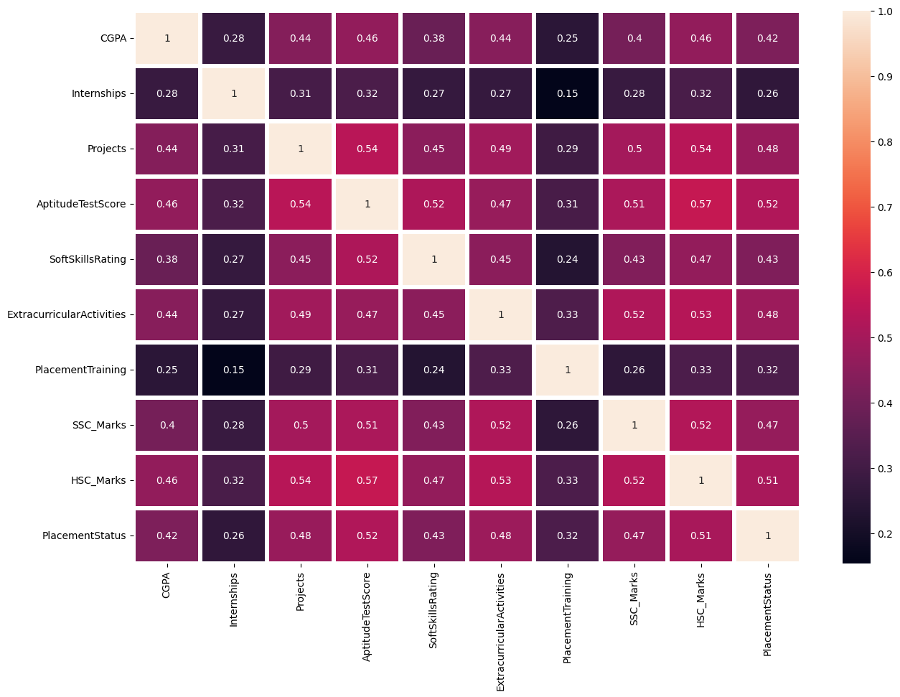

# Student Placement Prediction

This project is a Flutter application integrated with a machine learning model to predict the placement status of students based on their academic parameters. The application leverages a trained __AdaBoost Classifier__ to provide predictions with an accuracy of __82.07%__.
<br>
<br>
## How It Works
1. __Input Parameters__: The student inputs various academic parameters such as grades, attendance, extracurricular activities, etc.
2. __Machine Learning Model__: The application sends these inputs to a machine learning model trained using an AdaBoost classifier.
3. __Prediction__: The model processes the inputs and predicts whether the student is likely to be placed or not.
4. __Output__: The prediction is displayed on the application interface. 
<br>
<br>
## Technical Details
* **Frontend**: Built with Flutter, providing a cross-platform mobile application.
* **Machine Learning Model**: Developed in Python using libraries such as scikit-learn. The model is trained on a dataset with an AdaBoost classifier, achieving an accuracy of 82.07%.
* **Backend Integration**: The machine learning model is integrated with the Flutter application using Flask to enable predictions.
<br>
<br>
<br>

### Requirements
* Python
* Flutter
* Jupyter
* Flask

### Python Libraries used
* numpy
* pandas
* sklearn
* pickle

### Machine Learning Algorithms used
* Support Vector
* Logistic Regression
* Decision Tree classifier
* Random Forest Classifier
* AdaBoostClassifier

out of all, the highest accuracy is achieved with AdaBoostClassifer - 82.07%
<br>
<br>
<br>

### About Dataset
The dataset is taken from Kaggle.
It has the following features-
* Number of Rows/Datapoints - 10,000
* Number of Columns - 12 
* Total parameters to train the ML model- 9
    - CGPA
    - No. of Internship
    - No. of Projects
    - Aptitude Test Score
    - Softskill rating
    - ExtracurricularActivities
    - PlacementTraining
    - SSC_Marks
    - HSC_Marks
* Output class - PlacementStatus ( Placed, Not-placed)

The data is encoded to fit the model using LabelEncoder.


<div style="border: 1px #cccccc solid; padding: 4px; margin: auto; display: table">
    
    <figcaption style="background-color: #0f0f0f; color: white; font-style: italic; padding: 2px; text-align: center;">
        Fig. - Correlation Matrix Heatmap.
    </figcaption>
</div>


<br>
<br>


## How to run the app

clone the repository :

```
git clone https://github.com/ankurt02/Placement-prediction-flutter-ML.git
```
open the project folder

add required dependancies to pubspec.yaml

```
flutter pub get
```


download all the python libraries
```
pip install -r requirements.txt
```

### run the python-flask server
navigate to directory flask_app-> flask_app_file and run app.py, copy paste below command to do the above -
``` 
cd flask_app\flask_app_file
```

then run the following command to start server
```
python app.py
```


in the root directory of project, run the command

```
flutter run
```


to use the device preview, replace the main() code with the below code
```
void main()  async {
  await dotenv.load(fileName : "assets/.env");
  runApp(
  DevicePreview(
    // enabled: !kReleaseMode,
    builder: (context) => MyApp(), // Wrap your app
  ),
);}
```


# Screenshot of flutter app


<div style="display: flex; justify-content: flex-start; margin: 6px;">
    
    
</div>


# TODO

- [X] Make a simple UI

- [X] Integrate Machine Learning model, and predict status

- [ ] Make the app responsive for large screens

- [ ] Take user input and add to dataset


 
Flutter :blue_heart:


